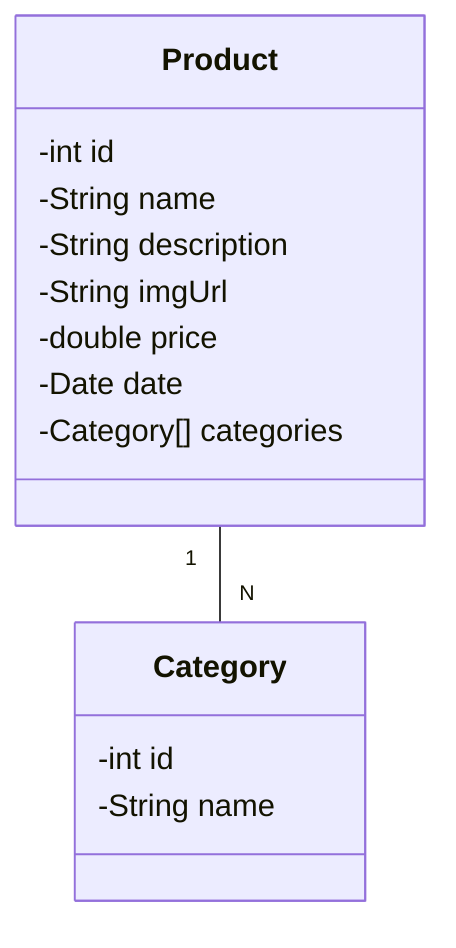

# catalog-marketstore

# Diagrama UML

```mermaid
classDiagram
    class Product {
        -int id
        -String name
        -String description
        -String imgUrl
        -double price
        -Date date
        -Category[] categories
    }

    class Category {
        -int id
        -String name
    }

    Product "1" -- "N" Category
```
